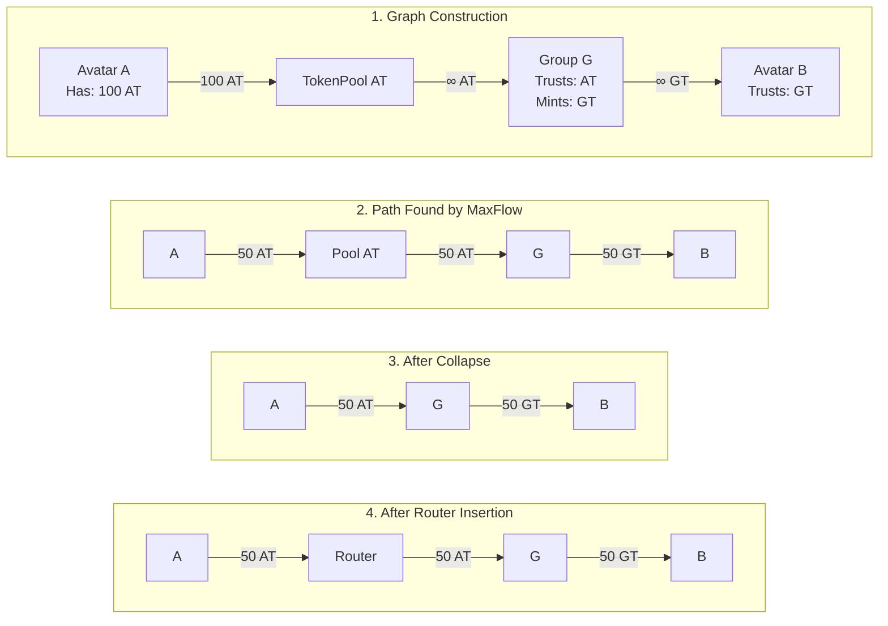

# BaseGroupMintRouter Contract Documentation

## Non-Technical Explanation

### Problem Statement

Currently, minting group tokens is only possible under the following condition:

1. **Avatar's personal CRC is trusted by the group**
2. **Avatar sends personal CRC directly to the group as collateral**, and the group mints group CRC to a recipient

**Critical constraint:** The destination node of a transfer flow MUST be the group node itself.

If a group node appears as an **intermediate node** in the transfer flow (not the final destination) and the final destination only accepts the group CRC, the transaction will revert within a SINGLE `operateFlowMatrix` call. This happens because:

- The operator (the address calling `operateFlowMatrix`) needs approval from the sender in the flow edge that precedes the group minting step
- Without this approval, the `safeBatchTransferFrom` call fails with `ERC1155MissingApprovalForAll`

### Use Case Example

**Scenario: A contract that only accepts group CRC**

When a user wants to interact with a contract (e.g., an offer contract) that only accepts group CRC, they currently must:

1. **Step 1:** Send their trusted personal CRC to the group to mint group CRC
2. **Step 2:** Send the newly minted group CRC to the target contract

This requires **two separate transactions**.

### The Solution

The Router contract enables **single-transaction flows** by:

1. **Acting as an intermediary organization node** that is inserted before group nodes in transfer paths
2. **Trusting all personal CRCs** that are trusted by any group it serves
3. **Granting operator approval** (`setApprovalForAll`) to all personal CRC holders, allowing them to transfer personal CRCs on behalf of the Router during `operateFlowMatrix` execution

### How This Changes User Experience

Users can now execute **one transfer flow** where:

- **Source:** User's address
- **Destination:** A contract/address that only accepts group CRC
- **Intermediate steps:** Group minting happens automatically along the path

The Router is inserted between the user and the group, providing the necessary approvals for the group minting operation to succeed.

---

## Technical Explanation

### Problem Statement (Technical)

Consider the following flow structure:

```
A ↔ B ↔ C ↔ D

```

Where:

- **A, B, D:** Avatar nodes
- **C:** Group node

**Assumptions:**

1. Avatar A wants to send CRC to Avatar D
2. D only accepts group CRC from group C (denoted as `grpC_CRC`)
3. A doesn't have enough `grpC_CRC` to send directly to D
4. A must rely on group minting during the flow

**What happens without Router:**

When A calls `operateFlowMatrix`, the execution flow is:

```
operateFlowMatrix
  → _effectPathTransfers
    → Executing flow edge B → C (B is avatar, C is group)
      → _groupMint(_sender: B, _receiver: C, _group: C, _collateral: acceptedCRC, ...)
        → safeBatchTransferFrom(from: B, to: toTokenId(C), ...)
          → sender = _msgSender() = A  // The operator calling operateFlowMatrix
          → isApprovedForAll(from: B, sender: A) = false
          → ❌ Revert: ERC1155MissingApprovalForAll(sender: A, from: B)

```

**Why it fails:**

- During `_groupMint`, the Hub calls `safeBatchTransferFrom` to transfer collateral from B to the group's treasury
- The `_msgSender()` in this context is A (the operator who initiated `operateFlowMatrix`)
- For this to succeed, B must have granted operator approval to A via `setApprovalForAll(A, true)`
- Without this approval, the transaction reverts

### Solution: Make `isApprovedForAll(from: B, sender: A) = true`

The Router contract solves this by:

**Creating an Organization node (Router) that:**

1. **Trusts every personal CRC** that is trusted by any group
2. **Grants operator approval** for all these personal CRCs by calling `setApprovalForAll(crc, true)`
3. This means: `isApprovedForAll(Router, personal_crc) = true` for all relevant CRCs

**Integration with Pathfinder:**

- The Router node is **inserted before the group node** in transfer paths by the Pathfinder algorithm
- This enables group minting to succeed at an intermediate step in the flow

**Router Contract Address:** `0xdc287474114cc0551a81ddc2eb51783fbf34802f`

---

## Example Flow

### Setup

```
A ↔ B ↔ C ↔ D

```

- **A (0xde37):** Avatar (Human)
- **B (0xdc28):** Router (Organization)
- **C (0xbfce):** Group
- **D (0xf7bd):** Avatar (Human)

**Constraint:** D only accepts group token C

### Workflow Parameters

**Input:**

```json
{
  "Source": "0xde374ece6fa50e781e81aac78e811b33d16912c7", // A: Human
  "Sink": "0xf7bd3d83df90b4682725adf668791d4d1499207f", // D: Human
  "toTokens": ["0xbfce3136dbe261e4dbd757bb9a718bed8a9993d5"] // C: Group token
}
```

### Flow Edges

| From              | To                | Token                 | Value     | Fraction |
| ----------------- | ----------------- | --------------------- | --------- | -------- |
| 0xde37 (A)        | 0xdc28 (B-Router) | 0x14c1 (Personal CRC) | 10.000000 | 100.00%  |
| 0xdc28 (B-Router) | 0xbfce (C-Group)  | 0x14c1 (Personal CRC) | 10.000000 | 100.00%  |
| 0xbfce (C-Group)  | 0xf7bd (D)        | 0xbfce (Group CRC)    | 10.000000 | 100.00%  |

### `operateFlowMatrix` Parameters

```json
{
  "method": "operateFlowMatrix",
  "params": {
    "_flowVertices": [
      "0x14c16ce62d26fd51582a646e2e30a3267b1e6d7e", // Personal CRC token
      "0xbfce3136dbe261e4dbd757bb9a718bed8a9993d5", // Group C (address = token)
      "0xdc287474114cc0551a81ddc2eb51783fbf34802f", // Router B
      "0xde374ece6fa50e781e81aac78e811b33d16912c7", // Avatar A
      "0xf7bd3d83df90b4682725adf668791d4d1499207f" // Avatar D
    ],
    "_flow": [
      { "streamSinkId": 0, "amount": "10000000000000000000" },
      { "streamSinkId": 0, "amount": "10000000000000000000" },
      { "streamSinkId": 1, "amount": "10000000000000000000" }
    ],
    "_streams": [
      {
        "sourceCoordinate": 3, // Index of A in flowVertices
        "flowEdgeIds": [2], // Terminal edge: C → D
        "data": "0x"
      }
    ],
    "_packedCoordinates": "0x000000030002000000020001000100010004"
  }
}
```

**Tenderly Simulation:** [View here](https://www.tdly.co/shared/simulation/eddbb268-3e96-4dc7-83e0-b82210858e60)

### Callflow Deep Dive

**Flow Edge 1: A → Router**

- Standard avatar-to-organization transfer
- No special handling needed

**Flow Edge 2: Router → Group C**

```
_effectPathTransfers
  → _groupMint(_sender: Router, _receiver: C, _group: C, _collateral: personal_CRC, ...)
    → safeBatchTransferFrom(from: Router, to: toTokenId(C), ...)
      → sender = _msgSender() = A  // The operator
      → isApprovedForAll(from: Router, sender: A) = true ✓
        // This is set by Router's enableCRCForRouting function
      → Transfer succeeds
      → GroupMint event emitted with sender=Router, receiver=C

```

**Flow Edge 3: Group C → Avatar D**

- Group C has newly minted group CRC
- This token is trusted by D
- Transfer completes successfully

---

## Pathfinder Integration

The Pathfinder algorithm generates `operateFlowMatrix` parameters given:

- **source:** Starting avatar
- **sink:** Destination avatar
- **amount:** Transfer amount
- **fromToken:** Token sent from source (optional)
- **toToken:** Token trusted by sink (optional)

### Construction Flow with Router



### Key Steps

**Assumption:** Avatar A sends 100 AT (personal CRC) to Avatar B, who only accepts GT (group token)

1. **Graph Construction:**
   - TokenPool (virtual node) for AT is created
   - Group G trusts AT as collateral and mints GT
   - Avatar B trusts GT
2. **Path Found by MaxFlow:**
   - Max flow of 50 AT is found: A → TokenPool → G → B
3. **After Collapse:**
   - TokenPool AT is removed (it's a virtual node)
   - Direct path: A → G → B
4. **After Router Insertion (Post-processing):**
   - Router is inserted before Group G
   - Final path: A → Router → G → B
   - Router accepts 50 AT and forwards to G for group minting
   - G mints 50 GT and sends to B

---

## Router Contract Implementation

### Key Features

1. **Single Public Function:** `enableCRCForRouting(address baseGroup, address[] memory crcArray)`
   - Enables personal CRCs to be routed through the Router for group minting
   - Validates that `baseGroup` was deployed by the Base Group Factory
   - For each CRC:
     - Verifies it's a human CRC
     - If the group trusts it, Router also trusts it
     - Grants operator approval via `setApprovalForAll(crc, true)`
2. **Admin Functions (Migration/Rollback Only):**
   - `freeze(bool _freeze)`: Blocks new routing setups during migration
   - `disableCRCForRouting(address[] memory crcArray)`: Removes trust and revokes approvals
3. **No Token Custody:**
   - Router does not hold CRC balances
   - No callbacks or fallback functions
   - Purely a routing facilitator

### Security Considerations

- **Immutable Admin:** Set at deployment, cannot be changed
- **Factory Validation:** Only groups deployed by the official factory are supported
- **Human CRC Only:** Only personal CRCs from registered humans can be enabled
- **Frozen State:** Admin can freeze to prevent new setups during migration

---

## References

- **Pathfinder Documentation:** [GitHub](https://github.com/aboutcircles/circles-nethermind-plugin/blob/dev/Circles.Pathfinder/PATHFINDER.md)
- **Path-based transaction doc**: [Github](https://github.com/aboutcircles/circles-contracts-v2/blob/beta/docs/docs/advanced-topics/path-based-transactions.md)
- **Router Contract Address:** `0xdc287474114cc0551a81ddc2eb51783fbf34802f`
- **Hub Contract:** `0xc12C1E50ABB450d6205Ea2C3Fa861b3B834d13e8`
- **Base Group Factory:** `0xD0B5Bd9962197BEaC4cbA24244ec3587f19Bd06d`
